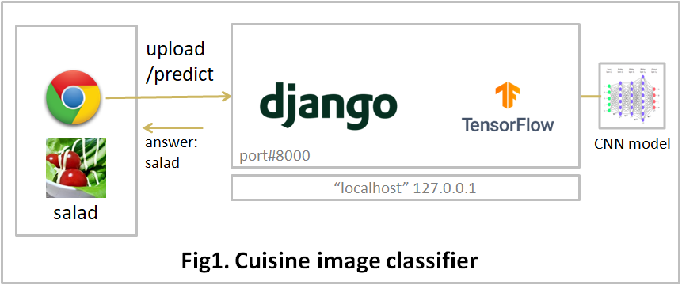

# cuisine-image-classifier

# 1. What you can do

* To predict which class an image belong to by using the pre-trained model. 
  The classification classes consist of "salad", "sushi" and "tofu".

* (CAUTION) This repository is for beginners' learning.  The precision of the model is not so good.

 

 

# 2. How to use

* Install the prerequisite python libraries

* Get a model file from the GitHub repository of 'cuisineimageclassifier-jupyter'

  STEP1: > git clone git@github.com:paw27182/cuisineimageclassifier-jupyter.git

  STEP2: Copy the model file of 'best_model_2.18.0.keras' to the following directory.

         ~/cuisineimageclassifier-django/cicapp/model

* Program start
  * cd cuisineimageclassifier-django
  * python.exe manage.py runserver 8000

 

* Open browser
  * http://localhost:8000/
  * Submit an image: 
   ./cuisineimageclassifier-django/tests/salad.jpg

 

# 3. System
* OS: Windows 10/11
* Web Framework: Django
* Python 3.13.11
* Python Libraries: See the requirements.txt file
* Bootstrap 5.2.3
* jQuery 3.7.1

 

# 4. Directories and Files Overview

| Directory/File |D/F| description |
| :------------- | :-| :---------- |
| cicapp | Dir | Django application directory |
| cicapp/model | Dir | Machine learning model |
| cicapp/command.py | File | Machine learning predict program |
| cicapp | Dir | application directory |
| cicproject | Dir | Django project directory |
| static | Dir | css, html, javascript files |
| templates | Dir | html files |
| tests | Dir | test image files |
| manage.py | File | Django management module |
| README.md | File ||
| requirements.txt | File | prerequisite libraries |
